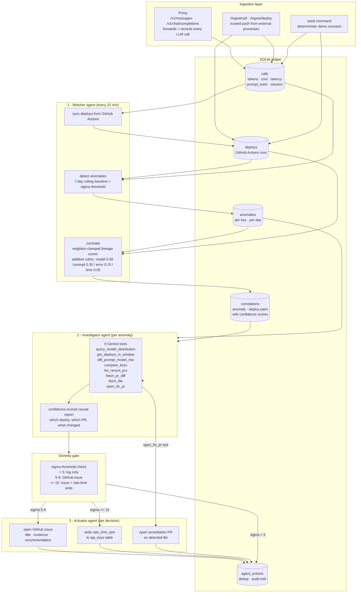

# LLMTrace Architecture

LLMTrace is a three-agent autonomous system for LLM observability and causal incident response. Each agent has a distinct responsibility and a clear handoff to the next.

---

## Agent pipeline



---

## The three agents

### 1 - Watcher (`internal/watcher`)

Runs every 15 minutes. No LLM involved — pure deterministic logic.

- syncs live deploy events from GitHub Actions into the ledger
- runs the anomaly detector: groups daily spend per API key, computes 7-day rolling mean and sigma, flags days where sigma >= 2.5 AND delta >= $1
- runs the correlator: for each anomaly, finds deploys in the window and scores each with an additive lineage rubric — model change (0.50), prompt change (0.30), error spike (0.15), time proximity (0.05). neighbor-clamped before/after windows so same-day deploys don't all claim credit for the same shift.
- hands off anomaly IDs to the Investigator

### 2 - Investigator (`internal/agent`)

A Gemini multi-turn tool-calling loop (up to 14 rounds). LLM-driven.

- receives an anomaly and the correlator's best-guess deploy
- calls 8 tools to build evidence: queries the ledger, diffs model and prompt distribution across the deploy boundary, fetches the actual PR diff from GitHub, reads files
- produces a confidence-scored causal report: which deploy, which PR, what changed in model/prompt mix, what the evidence is
- can call `open_fix_pr` to propose a remediation branch autonomously
- hands the report and sigma to the severity gate

### 3 - Actuator (`internal/actions` + `internal/watcher`)

Executes the decision from the gate.

| sigma | action |
|---|---|
| < 5 | log only, record in agent_actions |
| 5-9 | open GitHub issue with title, evidence, and recommendation |
| >= 10 | open GitHub issue + write rate_limit_rpm to the API key |

All actions are idempotent — `UNIQUE(anomaly_id, action_type)` in agent_actions means re-running the watcher never double-fires.

---

## Two attribution systems

The deterministic correlator and the Gemini investigator run in parallel and can disagree. This is intentional.

| system | how it works | output |
|---|---|---|
| Correlator | additive rubric, neighbor-clamped windows, no LLM | confidence score 0.0-0.95, evidence list, feeds /api/attribution |
| Investigator | reads actual PR diffs, reasons about code changes | narrative report, separate confidence, feeds dashboard and watcher |

The correlator is reproducible and machine-readable. The investigator reads code and writes the human story. Neither alone is sufficient — the rubric can't read a diff, the agent can't be trusted as an audit trail.

---

## Data flow (one complete incident)

```
1. LLM call arrives at proxy /v1/messages
2. proxy forwards to Anthropic, returns response to caller
3. go recordCall() fires: tokens, cost, latency, prompt_hash written to calls table
4. 15 min later: watcher.tick() runs
   a. sync deploys: new GitHub Actions runs ingested
   b. detect: daily spend rolled up, 7-day window, sigma computed, anomaly upserted
   c. correlate: deploy in window scored, correlation upserted
5. investigator.Investigate(anomaly) runs
   a. Gemini calls query_model_distribution, get_deploys_in_window, diff_prompt_model_mix
   b. fetches PR diff via fetch_pr_diff
   c. produces report: "deploy gha-129 shifted haiku→sonnet, +60% volume, confidence 0.95"
6. sigma >= 10: actRateLimit + actIssue fire
7. agent_actions row inserted (idempotent)
8. dashboard and /api/attribution reflect the full chain
```

---

## Key design decisions

**Why SQLite?** Single-tenant, single file, zero ops, one static binary. The tradeoff is no horizontal scaling and single-writer. Acceptable for self-hosted observability where you run one instance per team.

**Why Gemini for the agent while proxying Anthropic/OpenAI?** The cost-watching tool should not bill you for watching costs. Free-tier Gemini key means the investigation agent costs nothing to run.

**Why two attribution systems?** The rubric is reproducible and auditable — it feeds /api/attribution, which is a machine-readable API. The agent reads actual code diffs and writes the human story. They serve different consumers.

**Why neighbor-clamped windows in the correlator?** Without clamping, three same-day deploys all see the same model shift and tie. Clamping each deploy's before/after window to its neighboring deploys' completion times isolates which one actually caused the shift.

**Why idempotent writes everywhere?** Re-running detect, correlate, or the watcher should always be safe. Every write is an upsert keyed on natural identity — anomaly by (key, date, metric), correlation by (anomaly, deploy), action by (anomaly, action_type).

---

## Integration API

External tools can join their own work to llmtrace's attribution via two endpoints.

```
GET /api/attribution?sha=<commit-sha>
```
Given a git commit SHA, returns the deploy of that commit and any anomaly the correlator attributes to it, with confidence and evidence. Prefix-tolerant SHA match. Used by re_gent to walk agent turns back to their runtime cost.

```
GET /api/cost?session=<id>
GET /api/cost?from=<RFC3339>&to=<RFC3339>
```
Aggregates calls, tokens, and USD cost per model for a session or time window. Tag calls with `X-Llmtrace-Session: <id>` on proxied requests for exact session joins.
