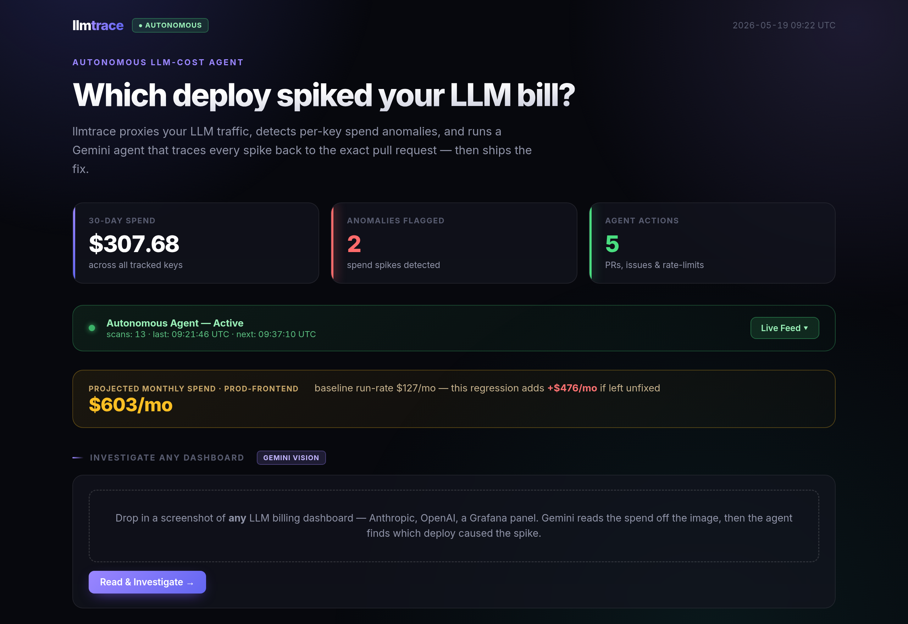

# llmtrace

**Self-hosted observability for AI agents.** Records every LLM call your agents make. Detects cost spikes and latency regressions. Names the deploy that caused them.

[](https://llmtrace-681081536857.asia-south1.run.app)   

```
$ llmtrace analyze --days 30

anomaly  key=prod-frontend  2026-05-03  $12.92 vs $4.68 baseline  (+$8.24, 28σ)

  → caused by deploy gha-129-summary-sonnet (PR #129)
    "switch summary endpoint to claude-sonnet", merged 14:05 UTC
    shifted prompt 19e978e3 from 91% haiku to 89% sonnet (+58% volume)
    confidence 0.95
```

---

## The problem

When an agent starts costing more, taking longer, or behaving differently, the first question is always the same: *what shipped?*

Existing observability tools (Helicone, Portkey, Langfuse, LiteLLM) show you the symptom. They don't connect it to the deploy. So you spend a Tuesday morning bisecting commits by hand, looking for the PR that flipped a model, rewrote a prompt, or added a retry loop.

`llmtrace` makes that join automatic. It sits in front of your agents as a self-hosted proxy and records every LLM call: tokens, cost, latency, model, prompt fingerprint, the lot. A rolling baseline flags spikes per API key. A Gemini agent then walks the ledger, pulls the GitHub deploys in the window, diffs the model and prompt mix before and after each one, and names the responsible PR with a confidence score and the evidence it used.

Cost spikes are the loudest signal. They're not the only one. Same join, different question: which deploy added 800ms to your p95? Which deploy changed what your summarizer actually says?

> Live demo: **https://llmtrace-681081536857.asia-south1.run.app**
> Deployed on Google Cloud Run. Autonomous agent runs on Gemini 2.0 Flash.

---

## How it works

```
Your LLM calls  ─►  llmtrace proxy  ─►  Anthropic / OpenAI
                         │
                         ▼
                 SQLite ledger (calls · cost · latency · prompt fingerprint)
                         │
                         ├──  Anomaly detector  (7d rolling baseline + σ threshold)
                         │
                         └──  Gemini agent  ─►  query_model_distribution
                                           ─►  get_deploys_in_window
                                           ─►  diff_prompt_model_mix
                                           ─►  Attribution + confidence score + PR link
```

1. **Proxy.** Point your app at `llmtrace serve` instead of `api.anthropic.com`. It forwards every request and records token usage, cost, latency, model, and a prompt fingerprint per call.
2. **Detect.** A rolling 7-day baseline flags per-key spend anomalies above a configurable σ threshold.
3. **Investigate.** A Gemini agent autonomously queries the ledger, finds nearby deploys, diffs the model+prompt mix before and after each deploy, and produces a causal attribution with evidence.

<p align="center">
  
</p>

---

## Demo: the cost-spike question

This is the canonical scenario. A team's summary endpoint was silently switched from `claude-haiku` to `claude-sonnet` in PR #129. The new prompt added a retry loop on top, pushing call volume up 60%. Daily spend on the `prod-frontend` key jumped from **$4.56 to $19.20** overnight. That's a 4.2× spike, 28σ above baseline.

The agent finds it in three tool calls:

```
anomaly: key=prod-frontend date=2026-05-03 actual=$12.92 baseline=$4.68 delta=+$8.24 sigma=28.0σ

[tool] query_model_distribution key=prod-frontend 2026-05-01 → 2026-05-05
       → 2 rows, 3554 total calls

[tool] get_deploys_in_window 2026-05-03T08:00:00Z → 2026-05-03T16:00:00Z
       → 1 deploys found

[tool] diff_prompt_model_mix prompt=19e978e38915 pivot=2026-05-03T14:05:00Z
       → before: 91% haiku · after: 89% sonnet (+58% volume)

── Attribution ──────────────────────────────────────────────────────────
The spend anomaly on prod-frontend on 2026-05-03 was caused by deploy
gha-129-summary-sonnet (PR #129) "switch summary endpoint to claude-sonnet",
which completed at 2026-05-03T14:05:00Z.

This deploy shifted prompt hash 19e978e38915 from predominantly claude-haiku
to predominantly claude-sonnet, a more expensive model.

Confidence: 0.95

Recommendation: Evaluate if the quality improvement from claude-sonnet
justifies the cost increase. Consider A/B testing or gradual rollout
for future model changes.
```

---

## Why not Helicone / Portkey / Langfuse / LiteLLM?

| Tool | Shape | Joins agent behavior to deploys? |
|---|---|:-:|
| Helicone | Hosted observability + caching | no |
| Portkey | AI gateway with routing | no |
| LiteLLM | Open-source proxy | no |
| Langfuse | LLM observability platform | no |
| **llmtrace** | **Self-hosted gateway with a causal investigation agent** | **yes** |

The wedge in one sentence: *deploy-causal observability for AI agents, with zero hosted-SaaS dependency.* The pattern was borrowed from [costtrace](https://github.com/Yatsuiii/costtrace), which does the same job for AWS cost.

---

## Quickstart

### Docker (Cloud Run or any host)

```bash
git clone https://github.com/Yatsuiii/llmtrace.git
cd llmtrace
cp .env.example .env          # add your GEMINI_API_KEY
docker compose up -d
```

Open `http://localhost:8080`. The dashboard loads with a demo scenario auto-seeded on first run.

Deployed on Google Cloud Run via `gcloud run deploy --source .`. The live demo above runs exactly this image.

Requirements: Docker and a `GEMINI_API_KEY` (free tier available at Google AI Studio).

### Local Go build

```bash
go run ./cmd/llmtrace seed                # seed 30 days of demo data
GEMINI_API_KEY=xxx go run ./cmd/llmtrace serve
# open http://localhost:8080
```

---

## CLI

```
llmtrace seed                        seed demo scenario into ledger
llmtrace serve [--port 8080]         run dashboard + agent server
llmtrace sync-deploys [--days 30]    ingest deploy events from GitHub Actions
llmtrace anomalies [--days 30]       detect and list spend anomalies
llmtrace correlate [--days 30]       match anomalies to deploys (scored lineage)
llmtrace analyze [--days 30]         detect anomalies + AI investigation
```

`correlate` runs the deterministic matcher: for each anomaly it finds deploys in
the window and scores each with an additive lineage rubric (model change 0.50,
prompt change 0.30, error spike 0.15, time proximity 0.05), isolating the cause
from innocent same-day deploys:

```bash
llmtrace correlate --days 30

anomaly #31  →  deploy gha-2-summary-sonnet (PR #2) "switch summary endpoint to claude-sonnet"
  confidence 0.55
    [time_window]  completed 2026-05-03T14:12:00Z, within the anomaly window
    [model_change] dominant model shifted claude-haiku to claude-sonnet (87% of post-deploy calls)

anomaly #31  →  deploy gha-1-deps-bump (PR #1) "bump anthropic SDK to 0.45"
  confidence 0.05
    [time_window]  time proximity only
```

`analyze` streams the full agent investigation to stdout, no browser needed:

```bash
GEMINI_API_KEY=xxx llmtrace analyze --days 30

detected 2 anomaly(ies)

── Anomaly 1/2: prod-frontend on 2026-05-03 ─────────────────────────
[tool] query_model_distribution ...
[tool] get_deploys_in_window ...
[tool] diff_prompt_model_mix ...

── Attribution ──────────────────────────────
... Confidence: 0.95
```

---

## Architecture

| Layer | What it does |
|---|---|
| `internal/proxy` | HTTP reverse proxy. Forwards to Anthropic and OpenAI, records call telemetry. |
| `internal/storage` | SQLite ledger via `modernc.org/sqlite`. Tables for calls, API keys, anomalies, deploys, correlations. |
| `internal/detect` | Rolling 7-day baseline plus σ-threshold anomaly detection. |
| `internal/deploys` | GitHub Actions ingestion. Maps successful workflow runs to deploy events. |
| `internal/correlate` | Deterministic anomaly-to-deploy matcher with additive lineage scoring. |
| `internal/agent` | Gemini multi-turn tool-calling agent. Autonomous causal investigation. |
| `internal/web` | Dashboard (Chart.js cost trend with deploy markers) and SSE investigation stream. |
| `internal/seed` | Deterministic demo scenario seeder, reproducible with fixed RNG. |

---

## Roadmap

`llmtrace` is in active development. Shipped:

- **v0.1 · MVP.** Proxy, ledger, per-key anomaly detection, Gemini investigation agent, autonomous watcher, live on Cloud Run.
- **v0.2 · Deploy correlation.** Live GitHub Actions ingestion (`sync-deploys`) into the deploy ledger, plus a deterministic time-window matcher with additive lineage scoring (`correlate`) that isolates the causing deploy from innocent same-day neighbors.

Next:

- **v0.3 · Multi-provider depth.** First-class OpenAI parser (already stubbed), then Bedrock InvokeModel.
- **v0.4 · Anomaly memory.** Embed every resolved anomaly and its root-cause PR. Similarity search over past incidents so the agent can say *"this looks like the spike from April 18, same author, same prompt, fixed by reverting deploy X."*
- **v0.5 · Forecast mode.** Convert rolling baselines into per-key spend forecasts. Predict which keys will blow budget within the hour, not just flag after the fact.
- **v0.6 · Latency and behavior signals.** Same causal join, applied to p95 latency regressions and prompt-output drift, not just cost. Deploy-to-behavior, not just deploy-to-spend.
- **vNext · Durable agent runs.** The natural arc: from observing other people's agents to giving them somewhere to live. Job execution backed by [rivet](https://github.com/Yatsuiii/rivet) (Postgres task queue, already shipped), so agent runs survive crashes and restarts. Earliest this happens is when customers ask for it.

Out of scope (explicit): multi-tenant SaaS, web UI dashboard polish beyond the current minimum, caching layer (that's Helicone/Portkey territory), prompt routing.

---

## Honest limitations

This is an MVP. Things to know before relying on it:

- **Single-tenant.** No per-tenant isolation. Run one instance per team.
- **Anthropic-first parsing.** OpenAI is supported but with less testing on streaming edge cases. Bedrock is not yet implemented.
- **Deploy correlation runs live or from the demo seed.** `sync-deploys` ingests real GitHub Actions runs; the bundled demo uses a seeded deploy table so the attribution is reproducible offline. PR linkage currently derives from the run's head commit, so mapping a run to its exact triggering PR is a known refinement.
- **Pricing is hardcoded** in `internal/pricing/rates.go` and needs manual updates when providers change rates.
- **SSE streaming is single-process.** No horizontal-scaling story for the dashboard yet.
- **Production security needs work.** TLS-required mode exists but inbound API key rotation is manual. Don't run on a public IP without a reverse-proxy in front.

These are MVP scope decisions, not unknowns. The trajectory is in the roadmap.

---

## Stack

- **Go** for the proxy, ledger, anomaly detection, web server. `net/http` and `html/template`, no framework.
- **SQLite** via `modernc.org/sqlite` (pure Go, no CGo, single file on disk).
- **Gemini** via `google.golang.org/genai` SDK for the tool-calling agent loop.
- **Chart.js** for the dashboard cost trend and deploy annotations (CDN, no build pipeline).
- **Google Cloud Run** for the production deploy (`gcloud run deploy --source .`).

---

## License

MIT.

---

<sub>Part of the [trace family](https://github.com/Yatsuiii) of operational tooling. See also [costtrace](https://github.com/Yatsuiii/costtrace) for the same pattern applied to AWS cost.</sub>

<sub>An earlier version of llmtrace was originally built during the AI Agent Olympics Hackathon at Milan AI Week 2026. It is now under continued active development as part of the trace family.</sub>
